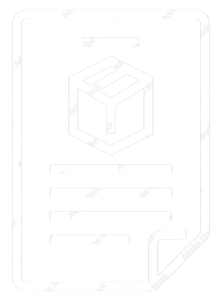

# Sololearn Coding Challenges

There are 72 or more problems from **SoloLearn Code Coach**. Over a period of 30 days or less, I aim to solve all these problems.
The problems are grouped by dificulty: Easy, Medium, Hard.

I will attempt 2 Easy, 2 Medium and 1 Hard problem each day and keep updating the README.md to reflect these changes.

Every problem will be found under the directory based on it's difficulty level.

Each problem will have a different directory that will comprise a README.md explaining the challenge.

To begin with, first round of solving these problems will be done in Python, then in C, then C++ and then more programming languages if possible.

The codes will be written on mobile device in Sololearn sandbox, sucessfully run and will pass all test cases provided by Sololearn. The link to my profile at Sololearn: <https://www.sololearn.com/profile/29143180>

## Easy

| 
  
                                            | 
  
             | 
  
 |
| ------------------------------------------------------ | -------------------------------------------------------------------- | -------------- |
| [Popsicles](Easy/Popsicles/README.md)                  | [Popsicles.py](Easy/Popsicles/popsicles.py)                          | May 17, 2023   |
| [Halloween Candy](Easy/HalloweenCandy/README.md)       | [HalloweenCandy.py](Easy/HalloweenCandy/halloween_candy.py)          | May 17, 2023   |
| [Fruit Bowl](Easy/FruitBowl/README.md)                 | [FruitBowl.py](Easy/FruitBowl/fruit_bowl.py)                         | May 18, 2023   |
| [Ballpark Orders](Easy/BallparkOrders/README.md)       | [BallparkOrders.py](Easy/BallparkOrders/ballpark_orders.py)          | May 18, 2023   |
| [Cheer Creator](Easy/CheerCreator/README.md)           | [CheerCreator.py](Easy/CheerCreator/cheer_creator.py)                | May 19, 2023   |
| [Skee-Ball](Easy/SkeeBall/README.md)                   | [SkeeBall.py](Easy/SkeeBall/skee_ball.py)                            | May 19, 2023   | >> easy |

## Medium

| 
  
                                            | 
  
             | 
  
 |
| ----------------------------------------------------------- | -------------------------------------------------------------------------- | -------------- |
| [The Spy Life](Medium/TheSpyLife/README.md)                 | [TheSpyLife.py](Medium/TheSpyLife/the_spy_life.py)                         | May 17, 2023   |
| [Pig Latin](Medium/PigLatin/README.md)                      | [PigLatin.py](Medium/PigLatin/pig_latin.py)                                | May 18, 2023   |
| [Safety Deposit Boxes](Medium/SafetyDepositBoxes/README.md) | [SafetyDepositBoxes.py](Medium/SafetyDepositBoxes/safety_deposit_boxes.py) | May 19, 2023   |
| [Snap, Crackle And Pop](Medium/SnapCrackleAndPop/README.md) | [SnapCrackleAndPop.py](Medium/SnapCrackleAndPop/snap_crackle_and_pop.py)   | May 19, 2023   | >> medium |

## Hard

| 
  
                                            | 
  
             | 
  
 |
| -------------------------------------------------------- | --------------------------------------------------------------------- | -------------- |
| [New Driver's License](Hard/NewDriversLicense/README.md) | [NewDriversLicense.py](Hard/NewDriversLicense/new_drivers_license.py) | May 17, 2023   |
| [It's a Sign](Hard/ItsASign/README.md)                   | [ItsASign.py](Hard/ItsASign/its_a_sign.py)                            | May 18, 2023   |
| [Mathematics](Hard/Mathematics/README.md)                | [Mathematics.py](Hard/Mathematics/mathematics.py)                     | May 19, 2023   | >> hard |

### Change-log

May 19, 2023 - Changed schedule to do 2 Medium problems a day, other categories remain unchanged.

&copy; All solutions belong to Chitrakshi Gosain. The challenge was started on May 17, 2023.
